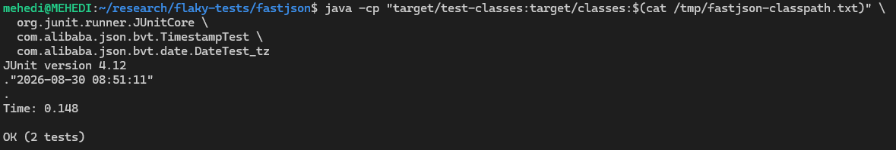
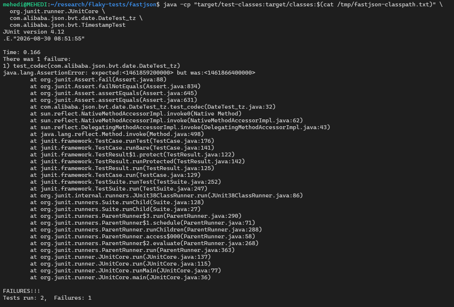
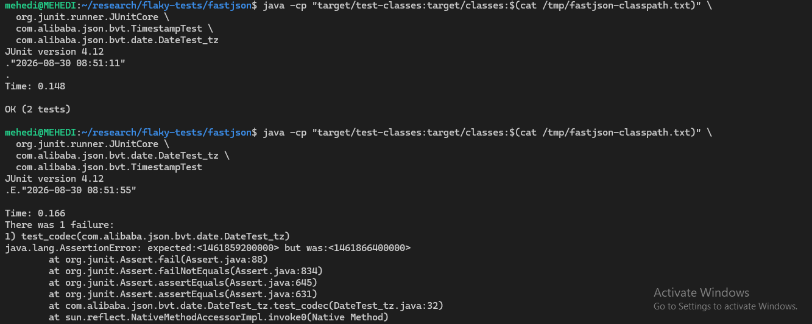
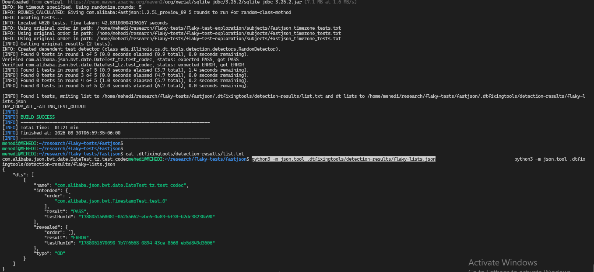
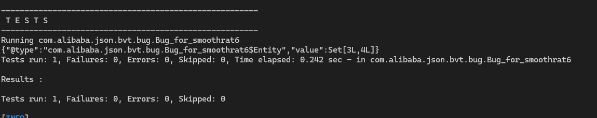
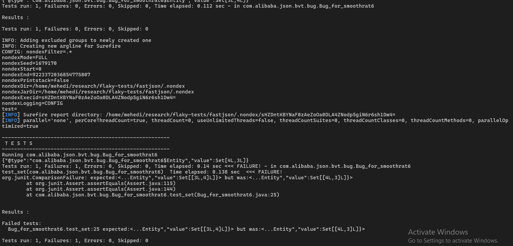
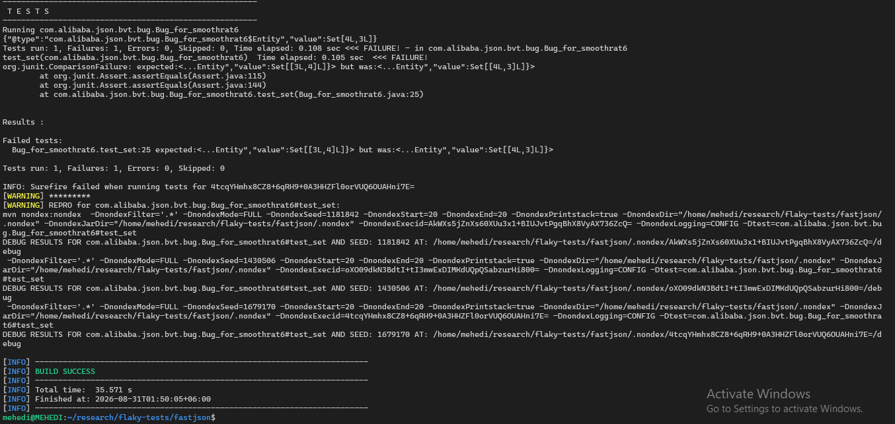
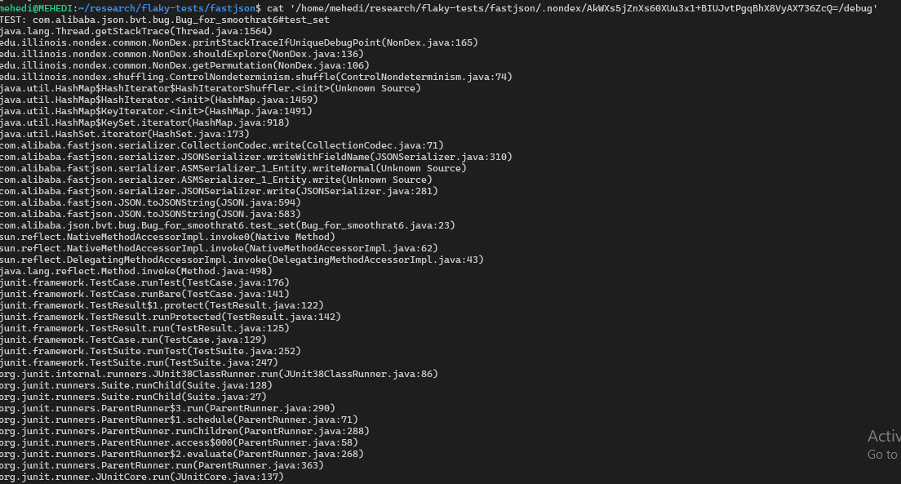

# Flaky Test Exploration

We used **IDoFT, iDFlakies, and NonDex** to analyze flaky tests from Alibaba Fastjson. A Python script searched the IDoFT dataset for a project containing multiple **order-dependent (OD)** and **implementation-dependent (ID)** tests at the same commit, so the project could be built once and the effort could stay focused on experimentation. From the selected Fastjson commit, we chose one OD test and one ID test, manually investigated their behavior, and then verified both using the corresponding tools. We also explored features such as targeted test orders and randomized rounds in iDFlakies, and multiple seeds and debug-point localization in NonDex.

## iDFlakies — Order-Dependent Test

**Test:** `com.alibaba.json.bvt.date.DateTest_tz.test_codec`  
**IDoFT Category:** `OD`

### Procedure
- Ran `DateTest_tz` alone and observed a timezone-related failure.
- Identified `TimestampTest` as a test that sets the shared `JSON.defaultTimeZone`.
- Ran the two tests manually in both orders using JUnit.
- Ran iDFlakies with a targeted two-test order and 5 randomized rounds.

### Findings
- `TimestampTest -> DateTest_tz` → **PASS**
- `DateTest_tz -> TimestampTest` → **FAIL**
- iDFlakies independently classified `DateTest_tz.test_codec` as **OD**.
- The passing order identified `TimestampTest.test_0` as the preceding test.
- Cause: shared mutable `JSON.defaultTimeZone`.

### Manual Verification — Passing Order

`TimestampTest` runs before `DateTest_tz`, and both tests pass.

### Manual Verification — Failing Order

Running `DateTest_tz` before `TimestampTest` reproduces the failure.

### Pass vs. Fail by Changing Test Order

The same two tests produce different results when their execution order is reversed.

### iDFlakies Detection

iDFlakies detected one dependent test and recorded `TimestampTest.test_0` in the passing order.

## NonDex — Implementation-Dependent Test

**Test:** `com.alibaba.json.bvt.bug.Bug_for_smoothrat6.test_set`  
**IDoFT Category:** `ID`

### Procedure
- Ran the test normally to establish a baseline.
- Ran NonDex first with its default 3 seeds.
- Increased the experiment to 20 seeds after the initial runs did not expose the failure.
- Used `nondex:debug` to locate the exact nondeterministic invocation.

### Findings
- Normal execution produced `Set[3L,4L]` → **PASS**
- Several NonDex seeds produced `Set[4L,3L]` → **FAIL**
- NonDex debug localized the behavior to `HashSet.iterator`.
- The stack trace connects the iterator to Fastjson's `CollectionCodec.write`.
- Cause: the test assumes a fixed `HashSet` iteration order, which Java does not guarantee.

### Normal Execution — Passing Test

Without NonDex perturbation, the set is serialized as `Set[3L,4L]`.

### NonDex Exposes a Different Iteration Order

Under a NonDex seed, the serialized output changes to `Set[4L,3L]`, causing the assertion to fail.

### NonDex Debug and Reproduction Information

The debug phase identifies reproducible failing seeds and narrows the failure to a specific nondeterministic invocation.

### Root-Cause Stack Trace

The debug stack shows `HashSet.iterator` followed by Fastjson's `CollectionCodec.write`, confirming that collection iteration order causes the failure.

## Overall Finding

The experiments reproduced two different flaky-test mechanisms:

- **iDFlakies:** test-order dependence caused by shared mutable state.
- **NonDex:** implementation dependence caused by an assumption about unspecified `HashSet` iteration order.

Manual reproduction and tool-based verification produced consistent results for both cases.
